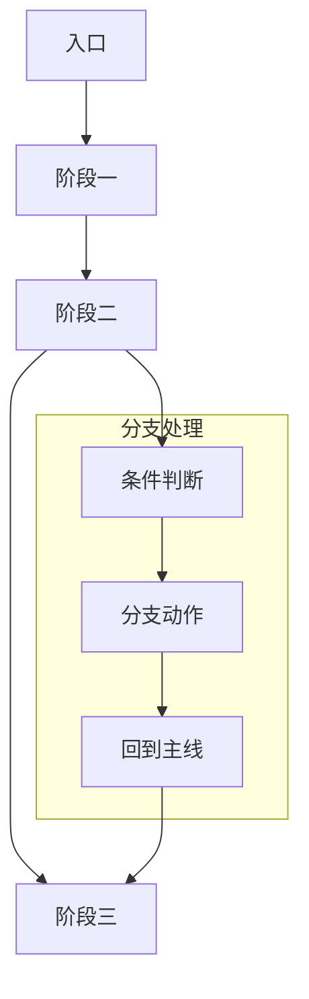
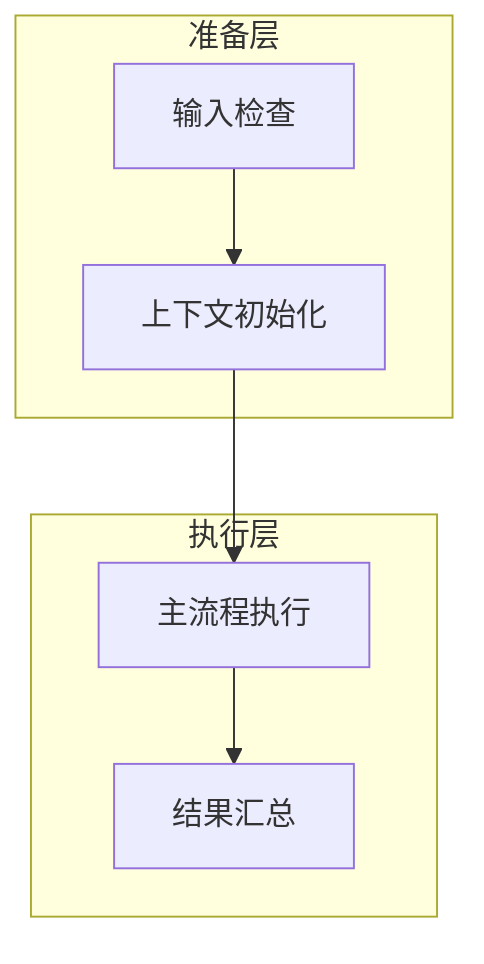
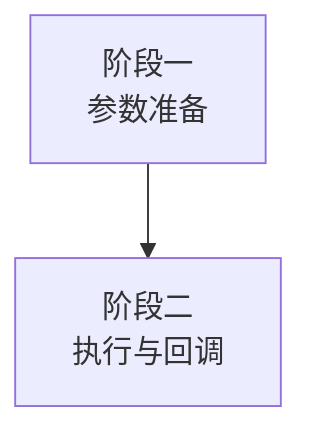

# Whiteboard Mermaid Patterns

Use compact, readable layouts. Prefer `TB` and grouped subgraphs when node count grows.

## 1. Main Flow + Local Branch

## 2. Two-Layer Pipeline

## 3. Line Break Rule

In Feishu whiteboard Mermaid labels, use ` ` instead of `\n`.

Example:

## 4. Whiteboard Revision Procedure

1. Delete old whiteboard block.
2. Create a new whiteboard block at the same index.
3. Fill the new whiteboard once.
4. Verify block structure and confirm only the new whiteboard remains.
